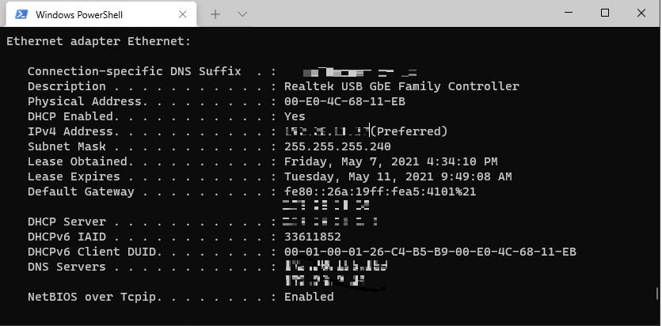
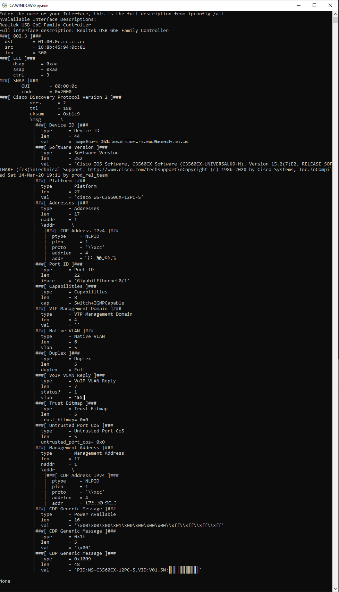

# Local Linksprinter
Small python program to collect switch port information directly from a laptop.

## Prerequisites
This assumes you also have Wireshark and NPCAP installed.  If not, got get that [here.](https://www.wireshark.org/download.html)
1. First you MUST install [python](https://www.python.org/downloads/).
2. Once you have python installed, update your path:
  * from the windows menu then search for path
  * open Edit System Environmental Variables
  * select Path and edit
  * click new to add a line
  * add `%HOME%\pip\pip.ini`
3. download a required package to run the local_linksprinter.py script:
  * open a windows command prompt
  * type `pip install scapy`
4. download the file local_linksprinter.py from this repo
5. open a command prompt as Administrator (start run cmd, right click, run as Administrator)
  * IF you were previously connected to the VPN client, such as the Big-IP Edge Client you might need to start NPACP
    * run `net start npcap`
  * run `ipconfig \all` and copy the description of the wired adapter you are currently using.
  * In the below example, mine is `Realtek USB GbE Family Controller`


5. double click on the local_linksprinter.py script, and paste in the Interface Description and hit enter.
  * If CDP is enabled on the interface you are connected to, you will see the device information printed in the terminal window within 60 seconds.


  * Press enter to exit the program.

### VPN Clients
Some VPN clients, including the F5 Big-IP Edge Client won't let you run tcpdump when connected (if configured as such), so you must disconnect and you might then need to re-start NPCAP from a command prompt as Administrator:
```
C:\WINDOWS\system32>net start npcap

The Npcap Packet Driver (NPCAP) service was started successfully.


C:\WINDOWS\system32>
```
